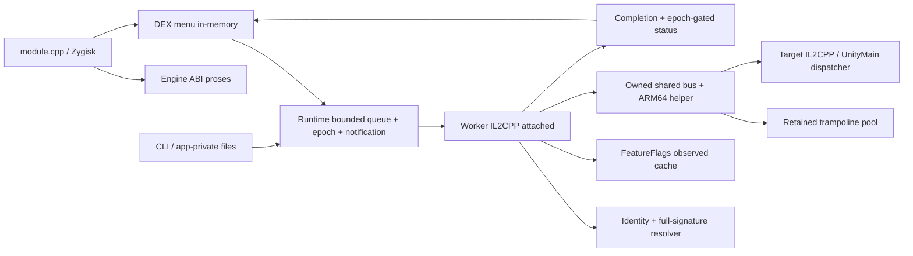

# WSM — WS Menu

Proyek modul Android untuk Guardian Tales, dengan loader Zygisk, engine native, helper ARM64, menu Java/DEX di dalam proses, serta transport command dan diagnostik. Implementasi aktif berada di [`src/wsm-v2`](src/wsm-v2). Repo GitHub ini bersifat **publik**.

**Rilis: `v6.3.0-rc1` (prerelease), module versionCode `60301`. Target exact: `com.kakaogames.gdts`, `versionName=3.54.0`, `versionCode=423`, Android API ≥26; ABI x86_64 dan arm64-v8a.** Build dan unit test terverifikasi tidak menyatakan seluruh efek gameplay sudah teruji. Modernisasi runtime, UI/UX dan build dijelaskan pada [laporan v6.3](docs/MODERNIZATION_V6_3.md). Migrasi modular awal dijelaskan pada [arsitektur v3 yang dikoreksi](docs/ARCHITECTURE_V3.md) dan [release notes RC1](docs/RELEASE_v6.3.0_rc1.md). Perbaikan crash RC3 tetap dicatat pada [laporan historis](docs/CRASH_REPAIR_RC3.md); bukti RC2/baseline 6.0.0 tetap merupakan riwayat terpisah.

## Status keseluruhan

Status verifikasi 8 Oktober 2026: paket lokal yang diuji berhash `ae0dcb92…`, dan 18 kontrol lolos pengiriman ON/OFF. Pemulihan opsi/PANIC diuji langsung; God/Opsi dan HP Protection memiliki observasi efek terbatas. Pulse damage, Freeze AI dan beberapa efek lain **belum memenuhi kualifikasi penuh**. Lihat [laporan runtime 8 Oktober](docs/RUNTIME_REPORT_20261008.md).

Desain asli berisi **47 fitur**. Semuanya tercatat dalam katalog, tetapi **31 belum memiliki backend aktif**. Menu menyediakan 18 kontrol native: 16 terkait desain, ditambah Damage Guard dan Radius Pulse. Tidak ada tombol ON palsu untuk fitur yang belum diimplementasikan. Pulse Power (`feat dmg`) dan Critical Pulse (`feat crit`) memakai pipeline UnityMain yang bertipe lengkap: power 1–99 menjadi damage tetap ×100.000, sedangkan critical mengatur kedua flag `critical` dan `noCritical`. Masing-masing dapat memulai pulse periodik; ONEHP menekan kedua modifier dan OHK tetap berprioritas. ACK ON menunjukkan konfigurasi armed; efek gameplay masih memerlukan pengukuran baseline/ON/OFF.

| Status katalog | Jumlah | Makna |
|---|---:|---|
| `partial` | 14 | Backend ada, cakupan lebih sempit daripada semantik desain |
| `prototype` | 2 | Backend eksperimental; efek kandidat belum dikualifikasi pada game |
| `not_implemented` | 16 | Backend belum tersedia |
| `authority_unverified` | 10 | Kontrak transaksi/persistensi belum terbukti |
| `target_absent` | 5 | Mekanik yang sesuai desain belum ditemukan dalam bukti yang tersedia |

`completed=0` dan `INCOMPLETE_47_FEATURE_SCOPE` merupakan gate kualifikasi. API yang ditemukan, ACK `applied`, atau nama fitur dalam UI bukan bukti efek gameplay sesuai desain. Lihat [matriks 47 fitur terkini](docs/FEATURES.md) dan [JSON evidence](src/wsm-v2/features/feature_catalog.json).

## Isi repo dan konteks sumber

| Lokasi | Peran |
|---|---|
| `src/wsm-v2/jni` | Loader, engine, worker, protocol, resolver, patching dan relokasi |
| `src/wsm-v2/payload` | Helper ARM64/native bridge dan synthetic branch self-test |
| `src/wsm-v2/menu` | Menu Android, state token dan katalog UI |
| `src/wsm-v2/module-template` | Installer modul dan metadata versi |
| `src/wsm-v2/scripts`, `tests` | Build, package verifier, kontrol ADB dan unit tests |
| `src/wsm-v2/features` | Snapshot lengkap desain, backend, status dan evidence API |
| `src/wsm-v2/docs`, `evidence` | Hasil audit/validasi bertanggal, termasuk baseline historis |
| `src/wsm` | POC lama; bukan jalur release aktif |
| `src/fixture` | Aplikasi fixture terisolasi; kunci debug dibuat secara lokal |
| `premium_menu_design` | Referensi React untuk desain 47 fitur; bukan engine Android |
| `docs/history` | Arsip sesi historis: peta sistem, pelajaran, resume, dossier, studi komparatif, review/preflight v2 dan catatan RE — bukan instruksi aktif |
| `analysis/dump-source-audit` | Inventaris dump, provenance, native disassembly dan audit Lua/API |
| `docs/context` | Konteks gabungan tiga root sumber awal |
| `.github/workflows/wsm.yml` | CI build/test dan CD release berbasis tag |

Dump asli berada secara lokal di `C:/Users/Administrator/Downloads/Mod/gt_dump`: **55.924 file, 7.130.490.825 byte**. Audit mencocokkan **155/155 hash input** katalog API dengan dump tersebut. Metadata memiliki 36.384 tipe dan 293.384 deklarasi method; 451.126 ScriptMethods termasuk generic. Kehadiran metadata, DummyDLL dan hasil dekompilasi tidak berarti seluruh body sumber game/server tersedia.

Repo menyimpan source WSM, snapshot evidence, inventaris dan laporan. Dump mentah, APK/library game, database SQLite API yang besar, toolchain, kunci lokal, `node_modules`, hasil build dan arsip historis tidak disimpan sebagai blob Git. ZIP module yang diverifikasi diterbitkan sebagai aset release. Audit source input lengkap tetap tersedia di [laporan dump](src/wsm-v2/docs/ORIGINAL_DUMP_AUDIT.md); CI memakai snapshot dan **tidak** melakukan ulang audit 155 input tanpa dump eksternal.

## Arsitektur dan perilaku runtime

Menu kini dipisah menjadi view Android, controller tanpa dependensi Android, backend JNI, scheduler terbatas, snapshot immutable dan penyimpanan profil. Status/JSON dibaca di worker; polling hasil command memakai timer tanpa menahan worker selama 35 detik. Panel terbuka meminta status setiap 1 detik, badge setiap 5 detik. Profil tersimpan hanya diterapkan melalui tindakan pengguna. Lihat [kontrak dan pengujian modernisasi](docs/MODERNIZATION_V6_3.md).

Runtime menerbitkan satu observasi 18 kontrol per putaran worker. Pembaca snapshot memiliki mutex terpisah dari antrean command. Status yang belum siap atau sedang restore mengirim fitur kosong agar UI mempertahankan label status terakhir sampai ada observasi yang dapat dipercaya. Command `telemetry` menyediakan kedalaman antrean, waktu tunggu, waktu penyelesaian dan revision.




Entry loader sekarang `module.cpp`; `loader.cpp` dipertahankan sebagai shim kompatibilitas source. Loader tetap membaca komponen sebelum specialization, mencocokkan allowlist, lalu menjalankan bootstrap protocol 3 dengan engine yang sesuai ABI. Antrean tetap 32 command, panjang command <192 byte, ring 64 completion dan maksimal empat command per tick. `accepted` berarti masuk antrean; `applied` berarti backend melaporkan berhasil. Keduanya belum membuktikan efek gameplay sesuai desain.

Runtime memakai condition variable dengan generation di bawah mutex yang sama agar submit/notify sebelum wait tidak hilang. Worker dibangunkan oleh command dan perubahan lifecycle. Batas pemeliharaan saat OFF/background/fault adalah 1.000 ms, saat fitur aktif 250 ms, dan selama callback UnityMain pending 25 ms. Shared bus memiliki notification generation terpisah dan memakai futex melalui libc untuk mailbox yang dimiliki WSM. Ini tetap memiliki deadline pemeliharaan; tidak ada klaim zero CPU.

Resolver metadata mempertahankan identity exact dan signature lengkap, membedakan MethodInfo dari pointer native, serta menolak overload ambigu, enumerasi terpotong dan signature yang tidak cocok. Scanner AOB hanya memeriksa span byte eksplisit yang dibatasi. Hasilnya bersifat diagnostik dan tidak mengizinkan fallback versi game lain. `FeatureFlags` menyimpan snapshot koheren 18 kontrol yang diamati; menulis cache tidak menjalankan fitur atau menghasilkan ACK sukses.

Pergantian scene/stage/hero dan background/resume menggunakan epoch. PANIC menaikkan epoch, menandai pending command stale dan meminta reset fisik state yang dimiliki WSM. Owner epoch dan gate publikasi mencegah snapshot lama menyatakan ready ketika reset masih pending. Panggilan native yang sedang berjalan tidak dapat dibatalkan seketika. Jika callback UnityMain masih berjalan, restoration menunggu jalur pembatalan yang dimiliki; kegagalan restoration membuat sesi fault dan memerlukan restart proses.

Helper tetap memakai bus 160 word dan 32 slot, timeout dikarantina, branch 4 byte dengan validasi jangkauan ±128 MiB, alias/rollback checks, dan halaman trampoline RW→RX sebelum publikasi. Pool mempertahankan halaman yang sudah dipublikasikan sampai proses berakhir: restore saja tidak membuktikan semua pembaca sudah selesai. Arena mempunyai kapasitas 512 ×16 KiB (8 MiB ruang virtual); kapasitas ini bukan bukti pengurangan RAM committed. Relokasi ADR/ADRP dan penolakan prologue yang belum didukung tetap dipertahankan.

Pipeline RC3 untuk Clear Stage/OHK/One HP tetap menggunakan UnitySynchronizationContext.ExecuteTasks yang memverifikasi UnityMain, GC handles, membership/stage checks dan pipeline damage game. Backend legacy yang terkait tetap ada sebagai kompatibilitas; migrasi ini tidak memindahkan seluruh offset lama atau membuktikan seluruh gameplay. Ghost threads, intersepsi/parking thread proteksi, stealth shadow remap dan syscall untuk menghindari monitoring tidak diterapkan.

## Build yang dapat diulang

Toolchain: **NDK 27.2.12479018 (r27c)**, JDK 17, Python ≥3.10, Android platform 34 dan build-tools 34.0.0. Target native/minimum runtime tetap API 26, dengan STL statis; SDK 34 adalah input kompilasi Java. CMake ≥3.22 dan Ninja diperlukan pada kedua backend untuk graph fixture native bersama. Zygisk API v4 header terpin SHA-256 di build script; notice lisensinya dipertahankan. Toolchain tidak dibundel dalam repo.

```powershell
git clone https://github.com/mysticgate38041/wsm.git
cd wsm
powershell -NoProfile -ExecutionPolicy Bypass -File src/wsm-v2/scripts/build.ps1 `
  -Ndk 'D:\Android\ndk\android-ndk-r27c' -Jdk 'C:\tools\jdk-17' `
  -Sdk 'C:\Android\sdk' -Python 'C:\tools\python\python.exe' -Jobs 2 -CatalogSnapshot
```

`-CatalogSnapshot` memvalidasi hash desain, 47 ID, semantik, mapping, selector evidence dan qualification yang sudah di-commit, lalu menghasilkan Java/header yang konsisten. Tanpa flag ini, generator membaca SQLite lokal `analysis/gt354-api/catalog-final/guardian_tales_354.sqlite` dengan `mode=ro`; mode tersebut memerlukan dataset eksternal dan mencatat hash aktualnya.

Daftar source engine, 14 fixture, versi dan stamp ditentukan oleh `scripts/build_manifest.json`; `generate_build_config.py --check` menolak drift generated inputs. Java/DEX memakai cache berdasarkan hash input dan output; dua suite Java tetap dijalankan pada cache hit. Generated inputs hanya ditulis jika isinya berubah.

Backend default adalah `ndk-build`. Untuk backend CMake gunakan command yang sama dengan tambahan `-NativeBuild CMake -CMake 'C:\tools\cmake\bin\cmake.exe' -Ninja 'C:\tools\ninja.exe'`. CMake 3.31.8/Ninja 1.12.1 digunakan dalam build lokal migrasi; CI memasang CMake 3.22.1 dari Android SDK.

Hasil: `src/wsm-v2/dist/wsm-v6.3.0-rc1.zip` dan `.zip.sha256`. Build memeriksa lima ELF, ABI/export/dependency/TEXTREL, LOAD/RELRO alignment 16 KiB, dua suite Java, cache build, DEX release, source/binary receipt dan regression package tests. Empat belas fixture native juga dikompilasi untuk setiap ABI: runtime, patch, binding, reloc, sweep, restore, flags, resolver, dispatcher, worker, pool, bus_event, status dan bootstrap. ZIP memiliki 14 entry, timestamp tetap dan manifest SHA-256. ZIP deterministik untuk input identik; perubahan source/toolchain/build provenance dapat mengubah checksum.

## CI/CD dan release

GitHub Actions berjalan untuk push `main`, pull request ke `main`, tag `v*`, serta dispatch manual. Job Ubuntu mengonfigurasi CMake, menjalankan empat belas fixture native dengan CTest, serta package rejection tests. Matrix Windows membangun dua ABI dengan backend `ndk-build` dan CMake, memvalidasi snapshot katalog, lalu mengunggah ZIP/checksum/provenance sebagai artifact 30 hari. Fixture Android dikompilasi; eksekusinya pada perangkat merupakan tahap tersendiri.

Job release hanya berjalan pada tag, setelah native-tests dan seluruh matrix build lulus. Tag harus cocok dengan stamp `v6.3.0-rc1`; ZIP dan checksum diverifikasi lagi sebelum GitHub prerelease dibuat. Aset publikasi diambil dari build `ndk-build`. CD memverifikasi source, receipt binary dan provenance terhadap commit/tag/run yang sama; pemasangan dan pengujian perangkat dilakukan terpisah.

Actions dipatok pada commit SHA resmi. Token default `contents: read`; hanya job publish mendapat `contents: write`. Tidak dibutuhkan PAT tambahan atau secret deployment. Checkout tidak menyimpan credential. Workflow merilis binary yang dibangun CI, disertai `ci-build-provenance.json` berisi commit, run, toolchain dan receipt. Release existing tidak di-clobber; retry dengan aset yang sudah ada akan gagal agar binary tidak tertimpa diam-diam.

Detail trigger, pin, prosedur tag, retry dan rollback: [CI/CD](docs/CI_CD.md). Perubahan dan batas kualifikasi saat ini: [release notes RC1](docs/RELEASE_v6.3.0_rc1.md). [Release notes RC3](docs/releases/v6.1.0-rc3.md) tetap merupakan riwayat.

## Instalasi, operasi dan pemulihan

1. Unduh ZIP dan checksum dari [GitHub Releases](https://github.com/mysticgate38041/wsm/releases), lalu cocokkan SHA-256 dengan `Get-FileHash -Algorithm SHA256`.
2. Cocokkan package/versi/code target dan ABI. Installer membutuhkan Android API ≥26, bootmode dan Magisk ≥26 untuk jalur Zygisk API v4; provider alternatif perlu kualifikasi tersendiri.
3. Cadangkan modul lama `wsm_gt`, pasang ZIP memakai pengelola modul, aktifkan provider Zygisk dan reboot secara manual.
4. Buka gameplay dan tunggu `ready`. Semua kontrol mulai OFF; profil tidak diterapkan otomatis. Uji kontrol satu per satu, kemudian OFF/PANIC, background/resume, ganti stage/hero dan cold start.
5. Untuk pemulihan, tutup game, nonaktifkan/hapus `wsm_gt` melalui pengelola modul dan reboot. Jika status fault/restoration gagal, restart proses diperlukan.

Command dan diagnostik lengkap: [COMMANDS_V6](src/wsm-v2/docs/COMMANDS_V6.md). Transport memakai root ADB dan file app-private dengan request ID serta completion correlation. `catalog 0..11` bersifat read-only. Katalog membedakan critical pulse dari 100% semua hit, refill periodik dari resource tak berkurang, pulse damage dari multiplier seluruh serangan, dan permintaan consume dari reward terkonfirmasi.

## Validasi perangkat dan tindak lanjut

Migrasi awal lulus build ndk-build/CMake, 35 package tests, sembilan catalog tests, 22 eksekusi fixture Android dan delapan kasus installer terisolasi. Pengujian lokal berikutnya menambahkan fixture restoration dan perbaikan ABI; hasilnya dicatat terpisah dalam [laporan runtime](docs/RUNTIME_REPORT_20261008.md). Suite saat rilis berisi 54 package tests (termasuk pemeriksaan paket Android hasil build), sembilan catalog tests dan 12 fixture native. Hasil commit/tag tersedia pada [GitHub Actions](https://github.com/mysticgate38041/wsm/actions/workflows/wsm.yml); aset rilis berasal dari run tag. Hardware ARM64 fisik, runtime 16 KiB, performa dan kualifikasi penuh efek gameplay masih belum terbukti.

RC2 sebelum publikasi diuji pada LDPlayer API 34: empat unit Android PASS, delapan kasus installer harness PASS, Java/DEX/package PASS, serta emitter ARM64 sintetis PASS melalui native bridge. APK probe menggunakan produksi `branch_selftest`, berada di proses terisolasi dan sudah dihapus. Bukti ini tidak menguji efek RC2 pada game atau ARM64 fisik. Checksum pada laporan historis merupakan build lokal saat itu; checksum aset yang diterbitkan harus diambil dari release dan provenance CI terbaru.

Untuk menyelesaikan scope 47, setiap fitur memerlukan kontrak target, backend dan restore, ownership/lifetime/thread qualification, pengukuran efek sesuai seluruh semantik desain, serta lifecycle/negative tests. Fitur currency/inventory/progress membutuhkan bukti transaksi dan persistensi; perubahan tampilan tidak memenuhi acceptance. Lihat [katalog dan matriks](docs/FEATURES.md), [audit RC2](src/wsm-v2/docs/ORIGINAL_DUMP_AUDIT.md), dan [validasi baseline historis](src/wsm-v2/docs/RELEASE_VALIDATION.md).

Pemberitahuan komponen pihak ketiga dan status lisensi proyek: [THIRD_PARTY_NOTICES](THIRD_PARTY_NOTICES.md).
