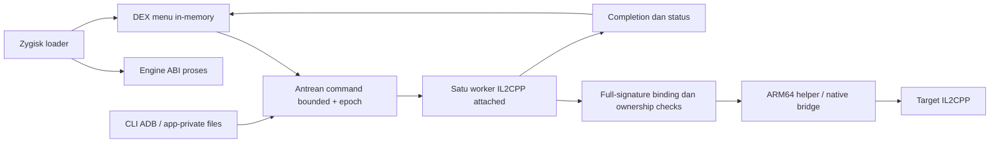

# WSM — WS Menu

Proyek modul Android untuk Guardian Tales, dengan loader Zygisk, engine native, helper ARM64, menu Java/DEX di dalam proses, serta transport command dan diagnostik. Implementasi aktif berada di [`src/wsm-v2`](src/wsm-v2). Repo GitHub ini bersifat **private**.

**Rilis: `v6.1.0-rc2` (prerelease). Target exact: `com.kakaogames.gdts`, `versionName=3.54.0`, `versionCode=423`, Android API ≥26; ABI x86_64 dan arm64-v8a.** Build dan unit test terverifikasi tidak menyatakan seluruh efek gameplay sudah teruji. Kandidat RC2 belum dikualifikasi pada proses game; pekerjaan awal pada baseline 6.0.0 merupakan bukti historis terpisah.

## Status keseluruhan

Desain asli berisi **47 fitur**. Semuanya tercatat dalam katalog, tetapi **31 belum memiliki backend aktif**. Menu menyediakan 18 kontrol native: 16 terkait desain, ditambah Damage Guard dan Radius Pulse. Tidak ada tombol ON palsu untuk fitur yang belum diimplementasikan.

| Status katalog | Jumlah | Makna |
|---|---:|---|
| `partial` | 14 | Backend ada, cakupan lebih sempit daripada semantik desain |
| `prototype` | 2 | Backend eksperimental; efek kandidat belum dikualifikasi pada game |
| `not_implemented` | 16 | Backend belum tersedia |
| `authority_unverified` | 10 | Kontrak transaksi/persistensi belum terbukti |
| `target_absent` | 5 | Mekanik yang sesuai desain belum ditemukan dalam bukti yang tersedia |

`completed=0` dan `INCOMPLETE_47_FEATURE_SCOPE` merupakan gate kualifikasi. API yang ditemukan, ACK `applied`, atau nama fitur dalam UI bukan bukti efek gameplay sesuai desain. Lihat [matriks 47 fitur terkini](docs/FEATURES.md) dan [JSON evidence](src/wsm-v2/features/feature_catalog.json).

## Isi repo dan konteks sumber

| Lokasi | Peran |
|---|---|
| `src/wsm-v2/jni` | Loader, engine, worker, protocol, resolver, patching dan relokasi |
| `src/wsm-v2/payload` | Helper ARM64/native bridge dan synthetic branch self-test |
| `src/wsm-v2/menu` | Menu Android, state token dan katalog UI |
| `src/wsm-v2/module-template` | Installer modul dan metadata versi |
| `src/wsm-v2/scripts`, `tests` | Build, package verifier, kontrol ADB dan unit tests |
| `src/wsm-v2/features` | Snapshot lengkap desain, backend, status dan evidence API |
| `src/wsm-v2/docs`, `evidence` | Hasil audit/validasi bertanggal, termasuk baseline historis |
| `src/wsm` | POC lama; bukan jalur release aktif |
| `src/fixture` | Aplikasi fixture terisolasi; kunci debug dibuat secara lokal |
| `premium_menu_design` | Referensi React untuk desain 47 fitur; bukan engine Android |
| `modernization-v2`, `v2-review`, `re` | Review, preflight dan catatan reverse engineering historis |
| `analysis/dump-source-audit` | Inventaris dump, provenance, native disassembly dan audit Lua/API |
| `docs/context` | Konteks gabungan tiga root sumber awal |
| `.github/workflows/wsm.yml` | CI build/test dan CD release berbasis tag |

Dump asli berada secara lokal di `C:/Users/Administrator/Downloads/Mod/gt_dump`: **55.924 file, 7.130.490.825 byte**. Audit mencocokkan **155/155 hash input** katalog API dengan dump tersebut. Metadata memiliki 36.384 tipe dan 293.384 deklarasi method; 451.126 ScriptMethods termasuk generic. Kehadiran metadata, DummyDLL dan hasil dekompilasi tidak berarti seluruh body sumber game/server tersedia.

Repo menyimpan source WSM, snapshot evidence, inventaris dan laporan. Dump mentah, APK/library game, database SQLite API yang besar, toolchain, kunci lokal, `node_modules`, hasil build dan arsip historis tidak disimpan sebagai blob Git. ZIP module yang diverifikasi diterbitkan sebagai aset release. Audit source input lengkap tetap tersedia di [laporan dump](src/wsm-v2/docs/ORIGINAL_DUMP_AUDIT.md); CI memakai snapshot dan **tidak** melakukan ulang audit 155 input tanpa dump eksternal.

## Arsitektur dan perilaku runtime



Loader mencocokkan allowlist proses, membaca komponen sebelum specialization, kemudian memakai memfd/dlopen dan bootstrap protocol 3. Engine memiliki satu worker mutasi, antrean 32 command, command <192 byte, ring 64 completion, maksimum empat command per tick 250 ms. `accepted` berarti masuk antrean; `applied` berarti operasi melaporkan berhasil. Status efek gameplay tetap membutuhkan pengukuran.

Pergantian scene/stage/hero dan background/resume membatasi sesi menggunakan epoch. PANIC membuang pending command dan meningkatkan epoch sehingga producer lama ditolak; panggilan native yang sedang berjalan tidak dibatalkan. Fault restoration bersifat sticky dan membutuhkan restart proses. Ledger opsi hanya menghapus flag yang dimiliki WSM; Time Scale hanya melepas modifier bernama `wsm`.

Helper ARM64 memakai bus 160 word, 32 slot dan timeout yang dikarantina. Hook menulis branch 4 byte, mengecek ±128 MiB, memulihkan izin alias dan mencoba rollback. Trampoline menggunakan halaman 16 KiB RW→RX. RC2 merelokasi ADR/ADRP yang ditemukan pada prologue getter critical damage; prologue literal-load atau control-flow yang belum didukung ditolak. Tail branch mempertahankan register prologue. Object lifetime dan Unity main-thread affinity masih memerlukan pembuktian; worker attached bukan dispatcher Unity main thread.

## Build yang dapat diulang

Toolchain: **NDK 27.2.12479018 (r27c)**, JDK 17, Python ≥3.10, Android platform 34 dan build-tools 34.0.0. Zygisk API v4 header terpin SHA-256 di build script; notice lisensinya dipertahankan. Toolchain tidak dibundel dalam repo.

```powershell
git clone https://github.com/mysticgate38041/wsm.git
cd wsm
powershell -NoProfile -ExecutionPolicy Bypass -File src/wsm-v2/scripts/build.ps1 `
  -Ndk 'D:\Android\ndk\android-ndk-r27c' -Jdk 'C:\tools\jdk-17' `
  -Sdk 'C:\Android\sdk' -Python 'C:\tools\python\python.exe' -Jobs 2 -CatalogSnapshot
```

`-CatalogSnapshot` memvalidasi hash desain, 47 ID, semantik, mapping, selector evidence dan qualification yang sudah di-commit, lalu menghasilkan Java/header yang konsisten. Tanpa flag ini, generator membaca SQLite lokal `analysis/gt354-api/catalog-final/guardian_tales_354.sqlite` dengan `mode=ro`; mode tersebut memerlukan dataset eksternal dan mencatat hash aktualnya.

Hasil: `src/wsm-v2/dist/wsm-v6.1.0-rc2.zip` dan `.zip.sha256`. Build memeriksa lima ELF, ABI/export/dependency/TEXTREL, LOAD/RELRO alignment 16 KiB, Java state, integritas DEX, source/binary receipt, lalu menjalankan 16 regression package tests. ZIP memiliki 14 entry, timestamp tetap dan manifest SHA-256. ZIP deterministik untuk input identik; perubahan source/toolchain/build provenance dapat mengubah checksum.

## CI/CD dan release

GitHub Actions berjalan untuk push `main`, pull request ke `main`, tag `v*`, serta dispatch manual. Job Ubuntu menjalankan empat unit host. Job Windows membangun dua ABI, menguji sembilan gate snapshot dan 16 gate paket, lalu mengunggah ZIP/checksum/provenance sebagai artifact 30 hari. Unit Android juga dikompilasi; eksekusi pada perangkat Android merupakan tahap manual tersendiri.

Job release hanya berjalan pada tag, setelah kedua job lulus. Tag harus cocok dengan stamp `v6.1.0-rc2`; ZIP dan checksum diverifikasi lagi sebelum GitHub prerelease dibuat. Workflow saat ini khusus RC2: rilis berikutnya harus memperbarui stamp, module.prop, path aset, guard tag, tests dan notes secara konsisten. Branch build tidak mengirim perubahan ke perangkat.

Actions dipatok pada commit SHA resmi. Token default `contents: read`; hanya job publish mendapat `contents: write`. Tidak dibutuhkan PAT tambahan atau secret deployment. Checkout tidak menyimpan credential. Workflow merilis binary yang dibangun CI, disertai `ci-build-provenance.json` berisi commit, run, toolchain dan receipt. Release existing tidak di-clobber; retry dengan aset yang sudah ada akan gagal agar binary tidak tertimpa diam-diam.

Detail trigger, pin, prosedur tag, retry dan rollback: [CI/CD](docs/CI_CD.md). Perubahan RC2 dan batas kualifikasi: [release notes](docs/releases/v6.1.0-rc2.md).

## Instalasi, operasi dan pemulihan

1. Unduh ZIP dan checksum dari release private, lalu cocokkan SHA-256 dengan `Get-FileHash -Algorithm SHA256`.
2. Cocokkan package/versi/code target dan ABI. Installer membutuhkan Android API ≥26, bootmode dan Magisk ≥26 untuk jalur Zygisk API v4; provider alternatif perlu kualifikasi tersendiri.
3. Cadangkan modul lama `wsm_gt`, pasang ZIP memakai pengelola modul, aktifkan provider Zygisk dan reboot secara manual.
4. Buka gameplay dan tunggu `ready`. Semua kontrol mulai OFF; profil tidak diterapkan otomatis. Uji kontrol satu per satu, kemudian OFF/PANIC, background/resume, ganti stage/hero dan cold start.
5. Untuk pemulihan, tutup game, nonaktifkan/hapus `wsm_gt` melalui pengelola modul dan reboot. Jika status fault/restoration gagal, restart proses diperlukan.

Command dan diagnostik lengkap: [COMMANDS_V6](src/wsm-v2/docs/COMMANDS_V6.md). Transport memakai root ADB dan file app-private dengan request ID serta completion correlation. `catalog 0..11` bersifat read-only. Katalog membedakan critical pulse dari 100% semua hit, refill periodik dari resource tak berkurang, pulse damage dari multiplier seluruh serangan, dan permintaan consume dari reward terkonfirmasi.

## Validasi perangkat dan tindak lanjut

RC2 sebelum publikasi diuji pada LDPlayer API 34: empat unit Android PASS, delapan kasus installer harness PASS, Java/DEX/package PASS, serta emitter ARM64 sintetis PASS melalui native bridge. APK probe menggunakan produksi `branch_selftest`, berada di proses terisolasi dan sudah dihapus. Bukti ini tidak menguji efek RC2 pada game atau ARM64 fisik. Checksum pada laporan historis merupakan build lokal saat itu; checksum aset yang diterbitkan harus diambil dari release dan provenance CI terbaru.

Untuk menyelesaikan scope 47, setiap fitur memerlukan kontrak target, backend dan restore, ownership/lifetime/thread qualification, pengukuran efek sesuai seluruh semantik desain, serta lifecycle/negative tests. Fitur currency/inventory/progress membutuhkan bukti transaksi dan persistensi; perubahan tampilan tidak memenuhi acceptance. Lihat [katalog dan matriks](docs/FEATURES.md), [audit RC2](src/wsm-v2/docs/ORIGINAL_DUMP_AUDIT.md), dan [validasi baseline historis](src/wsm-v2/docs/RELEASE_VALIDATION.md).

Pemberitahuan komponen pihak ketiga dan status lisensi proyek: [THIRD_PARTY_NOTICES](THIRD_PARTY_NOTICES.md).
