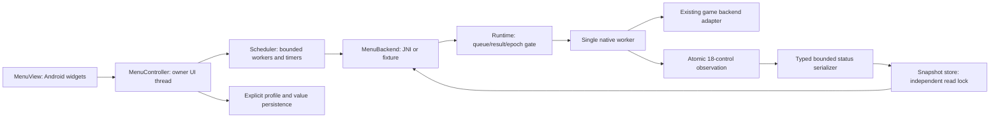
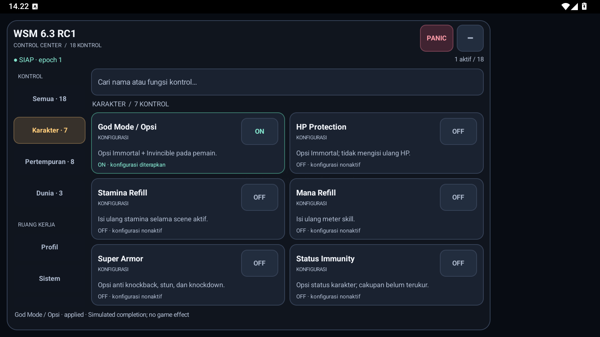

# WSM v6.3: runtime, menu dan build

Tanggal verifikasi: 9 Oktober 2026 (Asia/Jakarta). Target perubahan adalah arsitektur dan UI/UX untuk 18 kontrol yang sudah tersedia. Kontrak command, exact game identity, batas antrean dan protokol native tetap dipertahankan. Katalog 47 tetap menjadi referensi cakupan; efek gameplay belum seluruhnya terkualifikasi.

## Batas komponen

`WsmMenu` mengurus entry JNI dan lifecycle Activity. `MenuView` mengurus layout, focus, accessibility, kartu, filter, dialog dan pelepasan widget. `MenuController` mengurus state, completion, timeout, epoch, pembatalan dan profil tanpa dependensi Android. `MenuBackend` memisahkan kontrak dari transport. `AndroidMenuScheduler` membatasi dua worker dan 24 task antrean; controller membatasi 20 permintaan terlacak. Snapshot/profil immutable memisahkan observasi dan presentasi.

Native `Runtime` mengurus 32 command, 64 completion, ID dan epoch. `RuntimeSnapshot` memiliki mutex tersendiri; pembaca status tidak mengunci antrean. Publikasi melewati gate epoch lalu snapshot, tanpa urutan lock terbalik. `FeatureFlags::publish_observation` memvalidasi dan menerbitkan semua 18 nilai dalam satu transaksi. `runtime_status.h` membentuk JSON bertipe dan dibatasi kapasitas. Adapter `modern_control.inc` mengumpulkan observasi; hanya satu publikasi pada akhir putaran worker, setelah recovery.

Pemisahan ini mempertahankan backend game yang sudah ada. Backend efek, patch dan pulse belum dirombak seluruhnya. Dokumen ini tidak menyatakan source legacy telah hilang atau efek 18 kontrol telah terbukti pada game.

## State dan lifecycle

Completion terminal tidak dapat ditimpa hasil kedua. History tidak mengusir permintaan yang masih pending; submission berikutnya menerima backpressure. PANIC/invalidation menyembunyikan status ready lama segera, membatalkan antrean dan hasil pending dengan epoch baru. Pembaca status melihat satu snapshot koheren. Snapshot sama tidak menaikkan revision. Status belum siap/restoring mengirim `features:{}`; UI menampilkan status terakhir alih-alih mengarang konfirmasi OFF.

Controller menggunakan generation, epoch dan token untuk mengabaikan hasil terlambat. Poll result dijadwalkan bertahap 100–750 ms melalui timer; tidak ada worker yang tidur selama seluruh deadline 35 detik. Status dipanggil hanya satu pada satu waktu; watchdog 5 detik menonaktifkan kontrol ketika status macet. JNI yang telah berjalan tidak dapat diputus secara paksa. PANIC tidak menunggu antrean executor. Profil diterapkan berurutan dan berhenti saat gagal, epoch berubah atau PANIC.

Panel terbuka melakukan polling status 1 detik; badge 5 detik. Kartu dibuat sekali dan diperbarui berdasarkan perubahan state. Filter menggunakan teks pencarian yang telah dinormalisasi. Slider mempertahankan draft saat digeser dan mengembalikan nilai terkonfirmasi ketika permintaan ditolak. Layout landscape memakai rail dan dua kolom jika ruang cukup; portrait memakai tab horizontal dan satu kolom. PANIC tetap terlihat. Profil manual, sistem dan katalog berada di ruang terpisah dari kontrol utama.

## Diagnostik

Command `telemetry` menambahkan revision, counter submission/completion/rejection, queue depth/high-water, mean/max waktu antrean dan penyelesaian, wait/wakeup serta publikasi. Counter kumulatif process-local; snapshot status dan counter dibaca secara terpisah sehingga bukan transaksi pengukuran tunggal.

Loader merekam fase selected → inputs_ready → staged → worker_ready → engine_loaded → handshake_ready → probe_observed. Kegagalan pertama dan durasi fase dipertahankan. JNI local frame dan attachment worker dilepas sebelum diagnostic handshake wait. Unit bootstrap memverifikasi urutan fase dan waktu; ini tidak membuktikan penyebab SIGKILL historis telah diselesaikan.

## Build

`src/wsm-v2/scripts/build_manifest.json` menentukan versi, stamp, source engine dan 14 fixture. Generator menghasilkan input ndk-build, CMake, header versi dan metadata module. `--check` menolak drift; generator tidak menyentuh timestamp jika isi sama. Katalog juga tidak ditulis ulang jika bytes sama.

Kedua backend memakai graph CMake fixture bersama. Java/DEX mempunyai cache hash input, opsi dan seluruh output; perubahan source, tool input, output hilang/tampered atau opsi membatalkan cache. D8 menggunakan release mode. Dua suite Java selalu dieksekusi, termasuk saat compile cache hit. Source checkpoint dan binary receipt tetap wajib: source yang berubah selama build membuat paket ditolak.

## Verifikasi dan batas hasil

Bukti lokal disimpan di `.publish/modernization-20261009/`. [Receipt lokal](validation/v6.3.0-rc1-local.json) mencatat hash fixture CMake, hasil eksekusi dan hash kedua paket lokal; hash ini berbeda dari aset release yang dibangun CI.

| Gate | Hasil |
|---|---|
| ndk-build dan CMake | Keduanya lulus lima ELF, DEX dan package verification |
| Android native | 14/14 x86_64 + 14/14 ARM64 translation |
| Java | ControlStateTest + MenuControllerTest lulus |
| Python | 54 package + 9 catalog + 11 build/cache lulus |
| UI synthetic | 18/18 kontrol ON lalu OFF; PANIC, collapse, search, portrait/landscape |
| Profil synthetic | Simpan konfigurasi, PANIC, penerapan manual 18 kontrol, reset akhir |
| Build tanpa perubahan | CMake 6,17 detik lokal; Ninja no-work pada kedua ABI, cache Java/DEX HIT, kedua suite Java tetap dijalankan |

Waktu build adalah satu observasi lokal, bukan benchmark lintas mesin atau klaim percepatan terhadap baseline. Pembacaan UI awal saat profil sedang berjalan belum mencapai idle; pembacaan setelah 18 langkah selesai memverifikasi state akhirnya.

[Preview portrait](images/v6.3-ui-portrait.png). Aplikasi `com.wsm.preview` memakai view/controller produksi dengan backend simulasi; tidak memanggil JNI atau memuat modul ke game. Fixture ARM64 pada LDPlayer memakai translation pada host x86_64, bukan perangkat ARM64 fisik.

Belum ada pengukuran komparatif FPS, CPU, RAM atau frame latency pada game. Perubahan interval polling, locking dan graph build dapat diperiksa dari source serta fixture; persentase percepatan tidak diklaim. SIGKILL startup historis dan efek gameplay yang belum terkualifikasi tetap merupakan keterbatasan terpisah.
